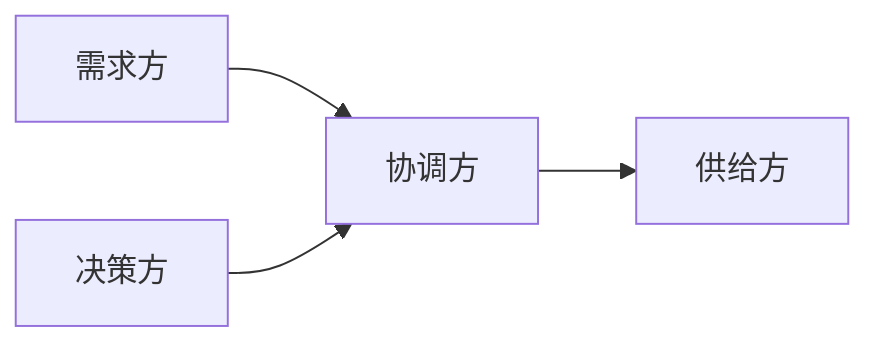

# 聊天记录整理规范

创建日期：2026-07-21
用途：当用户提供一段或多段聊天记录时，按照本规范整理成结构化的业务背景文档，便于后续需求分析、排期评估和知识传承。

## 〇、整理原则（全文统一约定）

1. **原文可追溯**：关键结论与决策尽量保留原文引用，并标注日期与发言人。
2. **状态图例**（全文统一使用）：✅ 已完成 / 🔄 进行中 / ⏳ 待办 / ❓ 待确认
3. **角色定义**（全文统一使用）：
   - 需求方：提需求的
   - 供给方：做开发的
   - 协调方：居中调度的
   - 决策方：拍板的
   - 依赖方：需要等别人做事的

## 一、文档结构模板

````markdown
# [业务主题名称] 业务背景

整理日期：xxxx-xx-xx
整理人：xxx
聊天记录时间范围：xxxx-xx-xx ~ xxxx-xx-xx
涉及消息数：约 N 条

## 一、业务概述

> 用 3~5 句话概括：这是什么业务、谁要的、解决什么问题、当前到什么阶段了。

[一段话概述]

## 二、本系统定位与职责边界

> 说明本系统在整个业务链路中的位置和职责边界；本系统无直接参与时可省略本节。

- **定位**：一句话说明本系统在链路中扮演什么角色（如：数据供给方 / 流程审批方）
- **负责**：本系统要做的事（如：提供 XX 查询接口、维护 XX 状态）
- **不负责**：明确排除的边界，防止后续职责扯皮（如：不承担 XX 文件的生成与推送）
- **依赖**：本系统需要谁提供什么（如：依赖 XX 团队提供 XX 数据）

## 三、参与方与角色

### 1. 人员清单

> 角色取值：需求方 / 供给方 / 协调方 / 决策方 / 依赖方（定义见规范开头"整理原则"）

| 姓名（花名） | 所属团队 | 角色 | 职责 |
|---|---|---|---|
| 张三(zhangsan) | XX团队 | 需求方 | 负责XXX |

### 2. 角色关系图

> 用 mermaid 描述各方协作关系，标清谁依赖谁、谁向谁汇报。



## 四、时间线与推进过程

> 按阶段划分，每个阶段有明确的时间范围、核心事件和里程碑。

### 阶段一：[阶段名称]（xx/xx ~ xx/xx）

**阶段目标**：一句话说明这个阶段要达成什么

| 日期 | 发言人 | 事件 | 关键信息/结论 |
|---|---|---|---|
| 4/28 | 张三 | 发起联调请求 | 确认xxx方式可行 |
| 4/29 | 李四 | 接口发版完成 | 接口已放开 |

**阶段结论**：这个阶段最终达成了什么、还差什么

> 更多阶段按同上格式依次展开。

## 五、业务需求与推进状态

### 1. 需求场景概述

> 如果涉及多个业务场景且数据流复杂，用 mermaid 说明整体数据流向；简单需求可省略本节。


### 2. 需求项与推进状态

> 状态取值见规范开头"整理原则"中的状态图例。

| 需求项 | 具体要求 | 提出方 | 状态 | 负责方/涉及方 | 依赖项 | 目标时间 | 备注 |
|---|---|---|---|---|---|---|---|
| 需求项A | 每日T+1同步数据 | XX团队 | ✅ 已完成 | XX团队 | 无 | - | - |
| 需求项B | 提供XX查询接口 | XX团队 | 🔄 进行中 | XX团队 | 依赖XX发版 | 8月 | 当前进展：XXX |
| 需求项C | 支持XX数据导出 | XX团队 | ⏳ 待办 | XX团队 | 无 | 8月 | - |
| 需求项D | XX口径待定 | XX团队 | ❓ 待确认 | A团队、B团队 | - | - | 有争议未定论 |

## 六、关键决策记录

> 记录聊天过程中做出的重要决策，便于后续追溯。原文依据需标注日期与发言人。

| 日期 | 决策内容 | 决策人 | 参与方 | 背景/原因 | 原文依据 |
|---|---|---|---|---|---|
| 5/11 | 采用xxx代理方案 | 张三 | 张三、李四 | SDK内置URL无法直接修改 | "xxx"（5/11 张三） |

## 七、风险与遗留问题（可选）

> 记录悬而未决的争议点、潜在风险和待跟进事项；没有遗留问题时本节可省略。

| 事项 | 类型（风险/争议/待跟进） | 涉及方 | 说明 | 跟进人 |
|---|---|---|---|---|
| XXX | 争议 | A团队、B团队 | 双方对XXX口径不一致 | 张三 |

## 八、参考资料

| 资料 | 链接/位置 | 说明 |
|---|---|---|
| 接口文档 | https://xxx | xxx接口 |
| 需求文档 | xxx.xlsx | xxx团队提供 |

## 九、核心概念与术语对照

> 聊天中涉及的领域概念、专业术语、系统名称、缩写代号等，统一在此解释。如涉及多个实体的层级关系，用 mermaid 或文字树形图展示。

| 术语/缩写 | 全称 | 说明 |
|---|---|---|
| XXX | XXX | 含义解释 |
````
